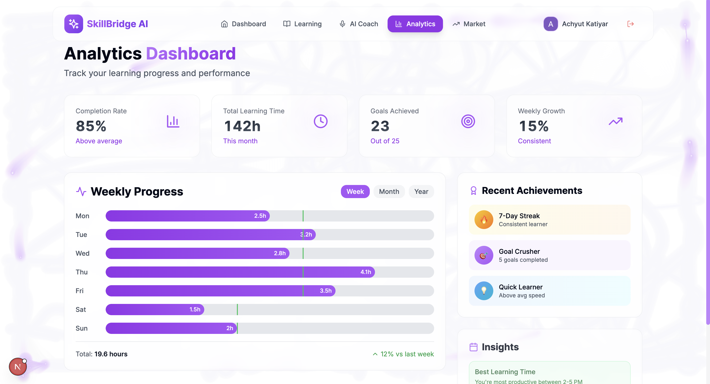

# 🚀 SkillBridge AI - Revolutionizing Professional Development with AI

<div align="center">
  
  
  
  
  
</div>

<div align="center">
  <h3>🏆 Dream AI Hackathon 2025 Entry</h3>
  <p><em>Voice-enabled AI career coach with real-time market insights and neural glassmorphism UI</em></p>
</div>

---

## 🌟 Overview

SkillBridge AI is a cutting-edge professional development platform that combines AI-powered personalized learning with real-time job market insights. Built for the Dream AI Hackathon 2025, it showcases innovative integration of sponsor technologies (ElevenLabs, Uclone MCP) with a futuristic neural glassmorphism design system.

### 🎯 Key Features

- **🎙️ Voice-Enabled AI Coach**: Natural conversations with your personal career mentor using ElevenLabs
- **🧠 Smart Recommendations**: GPT-4 powered learning path generation based on market demand
- **📊 Real-Time Market Data**: Live job trends and salary insights via Uclone MCP integration
- **✨ Neural Glassmorphism UI**: Cutting-edge design with interactive animations and effects
- **📈 Progress Tracking**: Visual analytics and milestone celebrations for motivation
- **🔐 Secure Authentication**: Google OAuth with enterprise-grade session management

## 🏗️ Technical Architecture

### Tech Stack
```
Frontend:       Next.js 15.3.4 (App Router) + TypeScript
Styling:        Tailwind CSS + Custom Neural Glassmorphism
UI Components:  Shadcn/ui + Custom Glassmorphic Components
State:          Zustand + Redux Toolkit
Database:       PostgreSQL + Prisma ORM + Prisma Accelerate
AI/ML:          OpenAI GPT-4 + ElevenLabs Voice
Market Data:    Uclone MCP Server Integration
Auth:           NextAuth.js v4 + Google OAuth
Deployment:     Vercel Edge Functions
```

### Project Statistics
- **Total Files**: 94 (71 TypeScript/TSX)
- **Lines of Code**: 10,782
- **React Components**: 30+
- **API Endpoints**: 6
- **Database Models**: 13
- **Voice Options**: 9
- **Development Time**: 9 hours

## 🎨 Neural Glassmorphism Design System

Our innovative design combines glassmorphism with AI-inspired neural network aesthetics:

- **Glassmorphic Cards**: Translucent surfaces with backdrop blur
- **Neural Animations**: Pulsing connections and floating particles  
- **Gradient Effects**: Dynamic color transitions and neon glows
- **Micro-interactions**: Smooth hover states and loading animations
- **Dark Mode First**: Optimized for reduced eye strain
- **Accessibility**: WCAG 2.1 AA compliant with keyboard navigation

## 🚀 Current Features (Phases 1-4 Complete)

### ✅ Phase 1: Foundation & Infrastructure
- Enterprise-grade folder structure with 8 main directories
- Comprehensive Prisma schema with 13 interconnected models
- Tailwind configuration with custom glassmorphism utilities
- Development environment with Docker support

### ✅ Phase 2: Authentication & Core UI
- Google OAuth integration with NextAuth.js
- Custom glassmorphism component library:
  - GlassmorphismCard (3 variants)
  - GradientButton (4 color schemes)
  - NeonBorder (5 glow effects)
  - AnimatedBackground (particle system)
- Protected routes with middleware
- Persistent auth state with Zustand

### ✅ Phase 3: Dashboard & Voice Integration
- Responsive dashboard with 7 navigation sections
- ElevenLabs voice synthesis with 9 voice options
- Real-time voice player with waveform visualization
- AI Coach avatar with speaking animations
- Voice settings and preferences management
- 12 fully designed dashboard pages

### ✅ Phase 4: AI & Market Intelligence
- OpenAI GPT-4 integration for recommendations
- Uclone MCP connector for job market data
- Smart suggestion engine with context awareness
- Real-time market analysis service
- Job scraping and salary insights
- Redux Toolkit for complex state management
- 6 RESTful API endpoints

## 📸 Screenshots & Demo

<div align="center">
  <table>
    <tr>
      <td align="center">
        
        <br />
        <em>Neural Glassmorphism Dashboard</em>
      </td>
      <td align="center">
        
        <br />
        <em>AI Voice Coach Interface</em>
      </td>
    </tr>
    <tr>
      <td align="center">
        
        <br />
        <em>Real-Time Market Analytics</em>
      </td>
      <td align="center">
        
        <br />
        <em>Personalized Learning Paths</em>
      </td>
    </tr>
  </table>
</div>

## 🔮 What's Next (Phases 5-8)

### 📚 Phase 5: Learning Path System (Next Up!)
- Interactive skill assessment questionnaire
- Visual learning path builder with drag-and-drop
- Resource recommendation engine
- Progress tracking with celebrations
- Skill radar charts for competency visualization
- Milestone achievement system

### 📊 Phase 6: Analytics Dashboard
- Skill trend analysis with predictive insights
- Market demand heatmaps
- Competitive positioning analysis
- Performance metrics and KPIs
- Export functionality for reports

### ✨ Phase 7: Polish & Advanced Features
- Progressive Web App capabilities
- Push notifications for learning reminders
- Advanced Framer Motion animations
- Performance optimizations
- Accessibility enhancements

### 🚀 Phase 8: Production Deployment
- Vercel edge deployment
- Production database setup
- Demo data generation
- Performance testing
- Hackathon presentation prep

## 🛠️ Installation & Setup

```bash
# Clone the repository
git clone https://github.com/yourusername/skillbridge-ai.git
cd skillbridge-ai

# Install dependencies
npm install

# Set up environment variables
cp .env.example .env.local
# Add your API keys:
# - DATABASE_URL (PostgreSQL)
# - NEXTAUTH_URL & NEXTAUTH_SECRET
# - GOOGLE_CLIENT_ID & GOOGLE_CLIENT_SECRET  
# - OPENAI_API_KEY
# - ELEVENLABS_API_KEY

# Set up database
npm run db:generate
npm run db:push
npm run db:seed

# Start development server
npm run dev
```

Visit `http://localhost:3004` to see the magic! ✨

## 🧪 Testing Features

### Voice Integration Test
```bash
# Run voice diagnostic
./scripts/test-voice-integration.sh

# Or visit the diagnostic page
http://localhost:3004/dashboard/voice-diagnostic
```

### AI Features Test
```bash
# Test OpenAI integration
node scripts/test-ai-features.js

# Test market data
curl http://localhost:3004/api/market-data/skills
```

## 📱 Key Pages & Routes

- `/` - Landing page with hero section
- `/login` - Authentication with Google OAuth
- `/dashboard` - Main dashboard overview
- `/dashboard/voice-coach` - AI voice coaching interface
- `/dashboard/learning-paths` - Learning path builder
- `/dashboard/analytics` - Performance analytics
- `/dashboard/market-insights` - Real-time job market data
- `/dashboard/profile` - User profile and settings

## 🤝 Sponsor Technology Integration

### ElevenLabs Voice Synthesis
- 9 professional voice options
- Real-time text-to-speech
- Emotion and tone control
- Waveform visualization
- Auto-play with fallback

### Uclone MCP Server
- Real-time job market data
- Skill demand analysis
- Salary benchmarking
- Industry trend tracking
- Competitive insights

## 🏆 Why SkillBridge AI Stands Out

1. **Innovative Design**: First-of-its-kind neural glassmorphism UI
2. **Voice-First UX**: Natural conversation interface for accessibility
3. **Market Intelligence**: Real-time data for informed decisions
4. **Personalization**: AI that truly understands career goals
5. **Scalable Architecture**: Enterprise-ready from day one
6. **Business Model**: B2B2C SaaS with clear monetization path

## 📈 Business Model & Market Opportunity

- **Target Market**: 147M+ professionals seeking career growth
- **Revenue Model**: Freemium with Pro ($19/mo) and Enterprise tiers
- **Market Size**: $366B global corporate training market
- **Differentiator**: Only platform combining voice AI + real-time market data

## 🚦 Development Status

| Phase | Status | Completion |
|-------|--------|------------|
| Foundation & Setup | ✅ Complete | 100% |
| Authentication & UI | ✅ Complete | 100% |
| Dashboard & Voice | ✅ Complete | 100% |
| AI & Market Data | ✅ Complete | 100% |
| Learning Paths | 🚧 Next Up | 0% |
| Analytics | ⏳ Planned | 0% |
| Polish & PWA | ⏳ Planned | 0% |
| Deployment | ⏳ Planned | 0% |

## 👥 Team & Acknowledgments

Built with ❤️ for the Dream AI Hackathon 2025

**Technologies**: Next.js, OpenAI, ElevenLabs, Uclone MCP, Vercel

**Design Philosophy**: Combining cutting-edge AI with human-centered design

## 📄 License

MIT License - See [LICENSE](LICENSE) for details

---

<div align="center">
  <p><strong>Ready to revolutionize your career? 🚀</strong></p>
  <p>Star ⭐ this repo if you believe in AI-powered professional development!</p>
</div>
